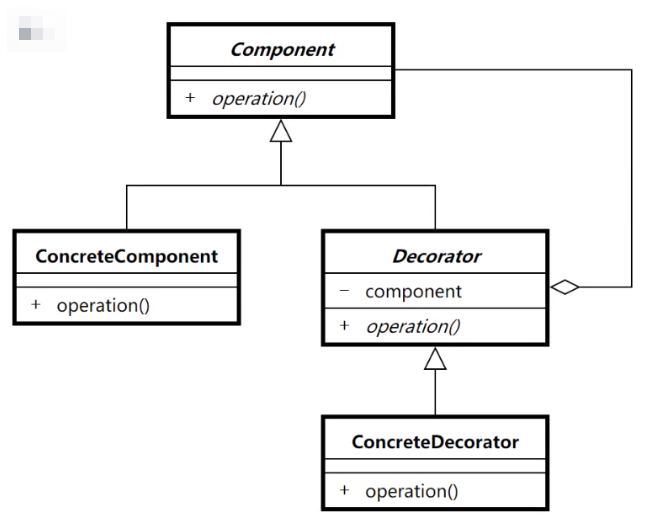

# 装饰器模式

### 应用场景

1. 扩展一个类的功能或给一个类添加附加职责。
2. 当希望重用几个现有的子类，这些子类缺少一些不能添加到超类中的公共功能时，请使用该模式。

### 优点

- 不改变原有对象的情况下给一个对象扩展功能
- 使用不同的组合可以实现不同的效果
- 符合开闭原则

### 源码中的应用

- javax.servlet.http.HttpServletRequestWrapper
- javax.servlet.http.HttpServletResponseWrapper
- java.util.Collections#list()
- org.springframework.context.event.GenericApplicationListenerAdpter

https://www.jianshu.com/p/4a530a3c70af

