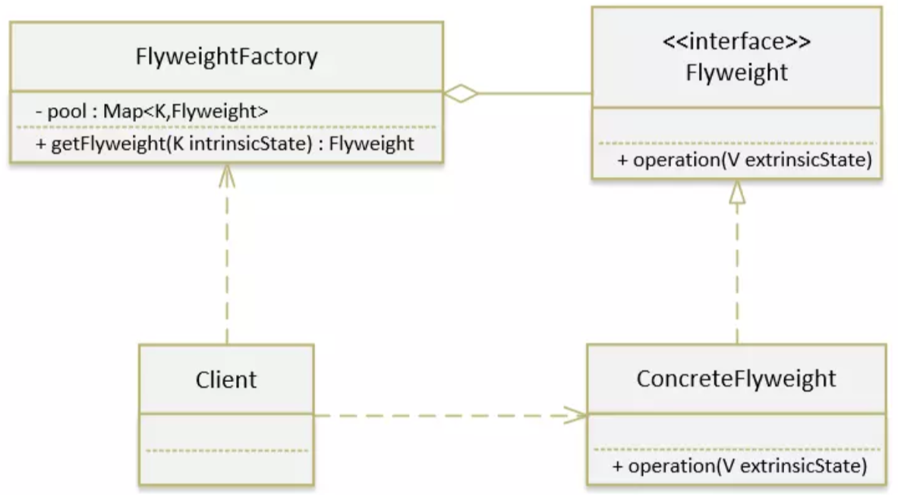

# 享元模式

### 应用场景

享元模式（Flyweight），换句话说就是共享对象，运用共享技术有效的支持大量细粒度的对象。说到享元模式，第一个想到的应该就是池技术了，String常量池、数据库连接池、缓冲池等等都是享元模式的应用，所以说享元模式是池技术的重要实现方式。

### 优点

1. 如果有大量类似的对象，可以节省大量的内存及CPU资源

### JDK源码中的应用

- String
- Integer
- Long
- InstructionConstants

