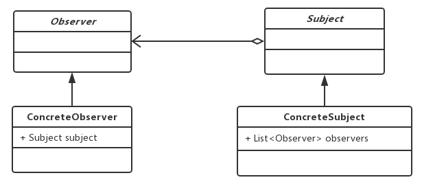

# 观察者模式

### 定义

> 观察者模式（Observer Pattern）定义了一种一对多的依赖关系，让多个观察者对象同时监听某一个主题对象。这个主题对象在状态发生变化时，会通知所有观察者对象，使它们能够自动更新自己。

### 应用场景

1. 当一个对象的改变需要同时改变其他对象的时候，可以考虑使用观察者模式。

### 优点

- 观察者模式实现了观察者和被观察者的解耦，易于维护、扩展和重用。

### 缺点

- 如果存在过多的观察者，运行效率低。效率问题可以考虑使用异步机制解决，但是必须保证异步逻辑自洽。同时还需要注意避免死循环（相互观察）的问题。

### 源码中的应用

- 

