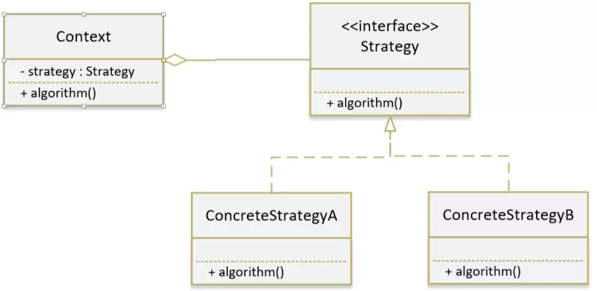

# 策略模式

### 定义

1. 策略模式（Strategy Pattern） 也叫 政策模式（Policy Pattern）。指的是对象具备某个行为，但是在不同的场景中，该行为有不同的实现算法。比如一个人的交税比率与他的工资有关，不同的工资水平对应不同的税率。

2. 策略模式 使用的就是面向对象的继承和多态机制，从而实现同一行为在不同场景下具备不同实现。

3. 策略模式 本质：分离算法，选择实现。

### 应用场景

1. 针对同一类型问题，有多种处理方式，每一种都能独立解决问题；
2. 算法需要自由切换的场景；
3. 需要屏蔽算法规则的场景；

### 优点

- 算法多样性，且具备自由切换功能；
- 有效避免多重条件判断，增强了封装性，简化了操作，降低出错概率；
- 扩展性良好，策略类遵顼 里氏替换原则，可以很方便地进行策略扩展；

### 源码中的应用

- 

