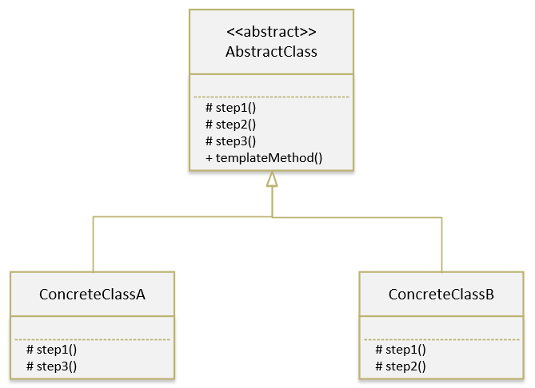

# 模板方法模式

### 定义

> 定义一个操作中的算法的框架，而将一些步骤延迟到子类中。使得子类可以不改变一个算法的结构即可重定义该算法的某些特定步骤。

### 应用场景

1. 多个子类有公有的方法，并且逻辑基本相同时；
2. 重要，复杂的算法，可以把核心算法设计为模板方法，周边的相关细节功能则由各个子类实现；
3. 重构时，模板方法模式 是一个经常使用的模式，把相同的代码抽取到父类，然后通过钩子函数约束其行为；

### 优点

- 算法多样性，且具备自由切换功能；
- 有效避免多重条件判断，增强了封装性，简化了操作，降低出错概率；
- 扩展性良好，策略类遵顼 里氏替换原则，可以很方便地进行策略扩展；

### 源码中的应用

- 

